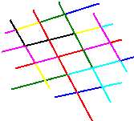
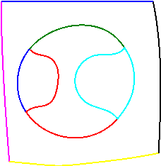
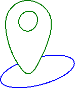
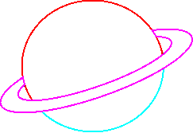

# Adobe Gen Solve Code 
<h2>How this works:</h2>

  This Python-based tool is designed for advanced geometric analysis, focusing on the detection, regularization, and completion of curves within path data. The code primarily operates on a series of coordinate paths, typically stored in CSV format, which represent various geometric shapes. The primary objectives of the tool are to identify incomplete or irregular curves, correct these irregularities, and complete any partial shapes using a combination of statistical and geometric methods.

Core Functionalities 

1. Path Data Reading and Visualization:
   The process begins by reading path data from a CSV file using the read_csv function. This data is then organized into a structured format that groups together points belonging to the same path. The plot function is employed to visualize these paths, making it easier to analyze the shapes and their respective coordinates. The visualization step is crucial for understanding the initial state of the curves before any processing.

2. Curve Detection and Regularization:
   The core of the tool’s functionality lies in its ability to detect specific geometric shapes within the paths. This is achieved through several specialized functions:
   - is_straight_line: This function uses linear regression to determine whether a given set of points forms a straight line. The determination is based on the coefficient of determination (R² score), which measures how well the points fit a linear model.
   - is_circle_or_ellipse: By calculating the mean and standard deviation of the distances of points from their centroid, this function determines whether the points form a circle or ellipse. A low variance in distances indicates a circular or elliptical shape.
   - is_rectangle: This function employs the Convex Hull algorithm to identify rectangles. It checks for four vertices in the hull and verifies that the angles between consecutive edges are approximately 90 degrees.

   After identifying the type of curve, the regularize_curves function corrects any deviations from ideal geometric forms. For instance, slight irregularities in what should be a straight line are adjusted, and polygons that should be rectangles are regularized.

3. Curve Completion:
   Another significant feature of this tool is its ability to complete incomplete curves. The complete_incomplete_curves function is designed to identify missing sections of a path and predict the most likely continuation of the curve. This is particularly useful in cases where only a portion of a shape is provided, allowing the tool to reconstruct the full form. The completion is achieved by analyzing the existing points and extending the curve in a manner consistent with the detected geometric pattern.

4. Symmetry Exploration:
   The tool also includes functionality to explore symmetry within the shapes using the explore_symmetry function. Symmetry detection helps in understanding the overall geometric harmony of the shapes and is essential in regularizing and completing curves.

5. Exporting Results:
   Once the paths have been processed, they can be exported as SVG files using the polylines2svg function. This function converts the processed paths into scalable vector graphics, which are useful for further analysis or for visual representation in design tools.

<b>Some of the Outputs are: </b>

